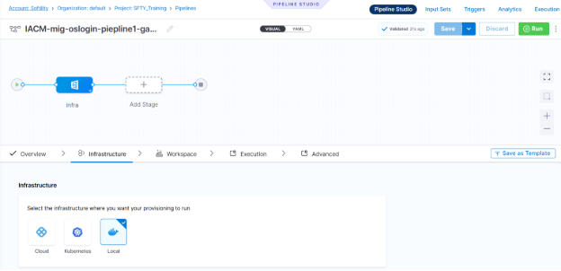
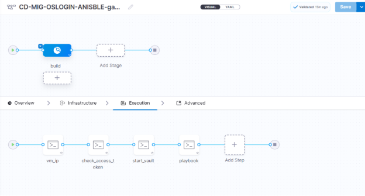

Pipeline 1:

Steps:

Here we just create the pipeline with variables choice \
<https://github.com/ganesh-redy/mig-oslogin-ansible.git>

Pipeline 2:

Here we take ip’s and store in ansible/hosts file and for ssh we take the private key from vault

Then ansible will connect to that system

Step 1: vm\_ip

gcloud compute instances list   --filter="name~'^okay-.\*'"   --format="value(networkInterfaces.accessConfigs.natIP)" | tr -d "[]'"  > /etc/ansible/hosts

cat /etc/ansible/hosts

\
Here we take the ip’s from gcp, instance named as okay because the mig instances base name is start with okay 

And store in ansible/host file\
\
step2: check\_access\_token

\
echo 'token <+secrets.getValue("oslogin-delegate-token")>'

here we have Docker delegate it consist token, that token was passed in runtime and place as variable in ansible this token was store in secrets.

Step 3: start vault

#!/bin/bash

\# Set Vault address

export VAULT\_ADDR='http://35.202.207.99:8200'

\# Stop any running Vault process

pkill vault || echo "No Vault process found."

\# Start Vault server in the background

nohup vault server -config=/etc/vault.d/vault.hcl > /var/log/vault.log 2>&1 &

\# Wait for Vault to start

sleep 5

\# Write unseal keys to /root/text

echo '<+secrets.getValue("ganesh-vault-unseal")>' > /root/text

cat /root/text

\# Unseal Vault using the keys

vault operator unseal "$(cut -d ' ' -f1 /root/text)"

vault operator unseal "$(cut -d ' ' -f2 /root/text)"

vault operator unseal "$(cut -d ' ' -f3 /root/text)"

\# Login to Vault

vault login '<+secrets.getValue("vault-usertoken-ganesh")>'

vault status

\# List secrets at path 'my/'

vault kv list my/

vault kv get my/private\_key

\# Retrieve the private key and save it securely

vault kv get -field=private-key my/private\_key > /tmp/privatekey

chmod 600 /tmp/privatekey

first we need export the vault ip of or local system then we can access ui 

\
\
step 4 :

#!/bin/bash

\# Fail on error

set -e

ls -l /tmp/privatekey

\# === [1] Variables ===

\# Replace with your actual playbook and VM user if different

ANSIBLE\_DIR="/etc/ansible"

INVENTORY\_FILE="$ANSIBLE\_DIR/hosts"

ANSIBLE\_CFG="$ANSIBLE\_DIR/ansible.cfg"

PRIVATE\_KEY\_PATH="/tmp/privatekey"

VM\_USER="sa\_106301816075024666979"

\

\# === [4] Write Ansible config ===

cat <<EOF > "$ANSIBLE\_CFG"

[defaults]

inventory = $INVENTORY\_FILE

host\_key\_checking = False

retry\_files\_enabled = False

remote\_user = $VM\_USER

private\_key\_file = $PRIVATE\_KEY\_PATH

EOF

\# === [5] Optional: Set environment to use this config ===

export ANSIBLE\_CONFIG="$ANSIBLE\_CFG"

\# === [6] Run Ansible ping to test connection ===

ansible all -m ping

git clone https://github.com/ganesh-redy/mig-oslogin-ansible.git

cd  mig-oslogin-ansible

\# === [7] Run your playbook ===

ansible-playbook -e 'token=<+secrets.getValue("oslogin-delegate-token")>' ansible.yaml

rm -f /tmp/privatekey

